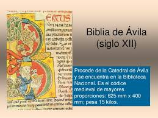

# Proyecto-Biblia

Welcome to the most exciting competition to become a data scientist!💪🏻

# En que consiste??

Tenemos que predecir el autor de un texto:

Para ello tenemos 2 datasets:
    
    -training_dataset.csv
    -test_dataset.csv

training_dataset.csv con los autores y test_dataset.csv sin ellos para que hagamos la prediccion

# Proceso

Comprobamos los 2 dataset, vemos que vienen limpios, sin nulos

Entreno varios modelos prediciendo los resultados de test en la columna autor, y lo subo a kaggle para ver los resultados
Son todos modelos de clasificacion.

# Utilizo :

Me centro en scikit-learn, son unas herramientas para predicir analisis de datos, para ello importo:
  RandomForestClassifier
  HistGradientBoostingClassifier
  DecisionTreeClassifier
  BaggingClassifier

# Conclusion:

El modelo HistGradientBoostingClassifier da resultados de casi 1
